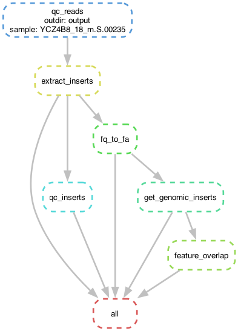

# Genomic Insert Analysis Pipeline

A Snakemake workflow for processing and analyzing genomic insert sequencing data, designed to extract inserts, align them to a reference genome, and identify overlaps with genomic features.



## Overview

This pipeline processes sequencing data through the following steps:
1. Quality control of raw reads using nanoq
2. Extraction of inserts using cutadapt (removing flanking sequences)
3. Quality control of extracted inserts
4. Conversion to FASTA format
5. Alignment to reference genome using minimap2
6. Identification of genomic feature overlaps using bedtools
7. Generation of reports and visualizations

## Requirements

- Python 3.11+
- UV package manager (`pip install uv`)
- Required command-line tools:
  - nanoq
  - cutadapt
  - seqtk
  - minimap2
  - samtools
  - bedtools

## Installation

Clone this repository and install dependencies using UV:

```bash
git clone <repository-url>
cd pioneer-takehome
uv pip install -e .
```

## Usage

1. Configure the pipeline by editing `config.yaml`
2. Ensure your input files are in the designated directories
3. Run the complete pipeline:

```bash
uv run snakemake -c1
```

To run specific steps:

```bash
uv run snakemake -c1 <rule_name>
```

To clean outputs:

```bash
uv run snakemake clean
```

## Data Structure

- `refs/` - Reference genomes and annotation files
- `output/` - All output files organized by processing step
  - `raw/` - Raw input data
  - `raw_nanoq/` - QC results for raw data
  - `inserts/` - Extracted insert sequences
  - `inserts_nanoq/` - QC results for inserts
  - `bam/` - Alignment files
  - `overlaps/` - Genomic feature overlaps
  - `report/` - Analysis reports and visualizations
  - `logs/` - Log files for each processing step

## Analysis

After running the pipeline, you can analyze the results using:

```bash
uv run jupyter notebook report.ipynb
```

The GFF analysis script can be run separately:

```bash
uv run python gff_analysis.py
```